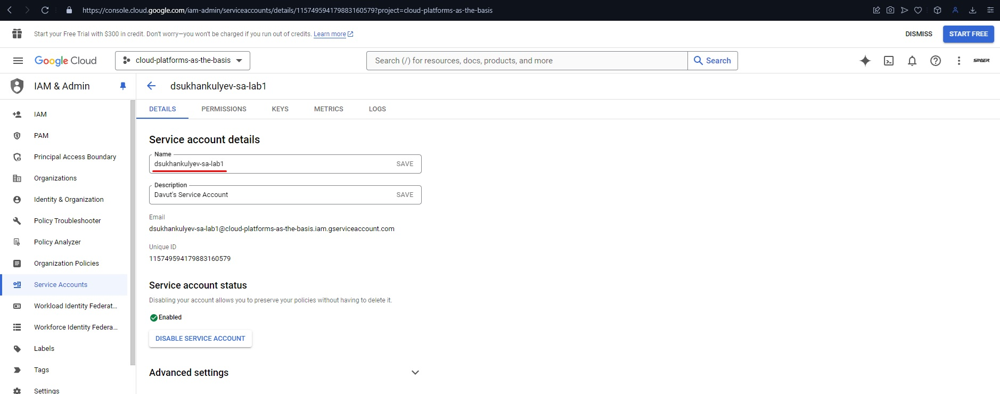
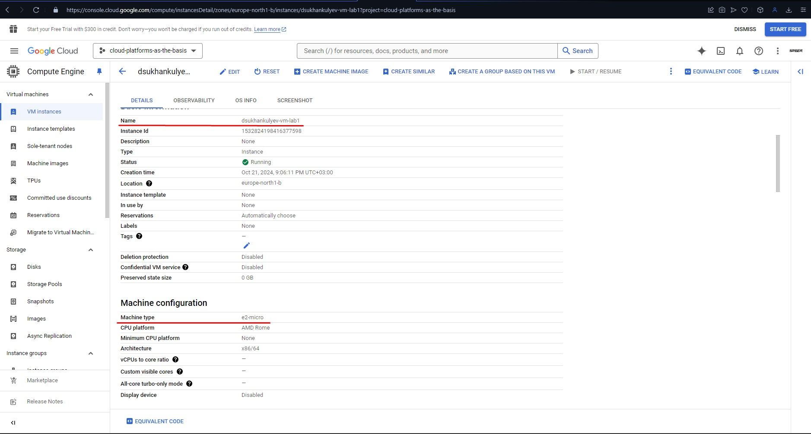
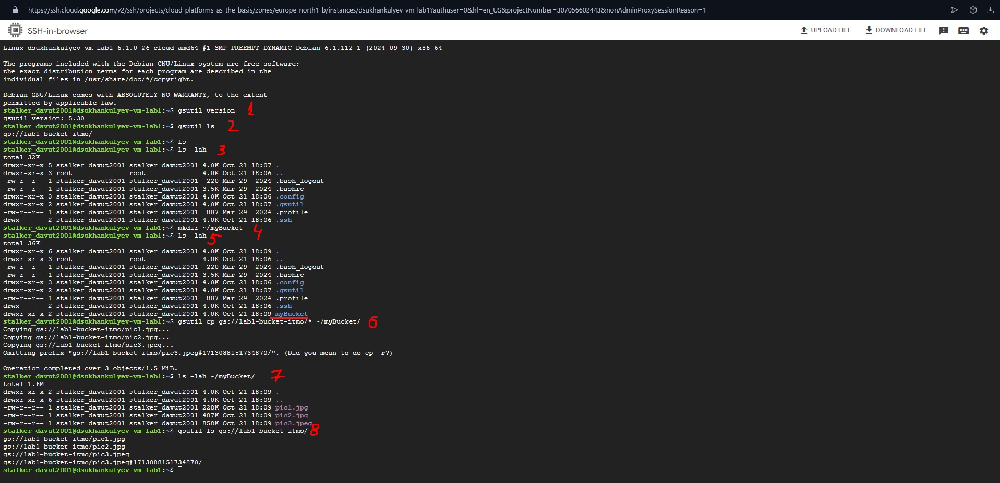
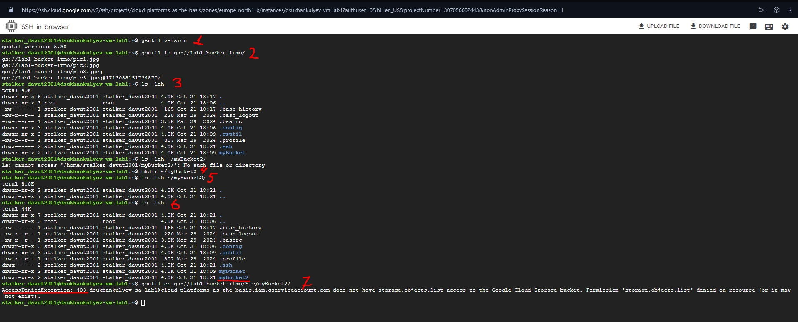

# Lab 1 - Overview of Google Cloud and Exploration of Key Services
## Task

### Objective
Become familiar with the main capabilities and advantages of the Google Cloud platform.

### Procedure

1. Go to the IAM tab and create a service account with the role of Storage Admin.

   - Use the first letter of your first name and your last name for naming, and add `-sa-lab1`. For example, Davut Sukhankulyev = `dsukhankulyev-sa-lab1`.

2. Create a minimal compute engine (virtual machine) with a Machine type of e2-micro in spot mode.

   - Use the first letter of your first name and your last name for naming, and add `-vm-lab1`. For example, Ivan Filianin = `dsukhankulyev-vm-lab1`.

3. Use the `gsutil` tool to find the bucket `lab1-bucket-itmo` and copy 3 files to a local folder on the VM. Use the command `ls -lah` to display that these files are stored on your VM.

4. Change the access rights for your service account from Storage Admin to Compute Viewer and try to repeat the data copying step. Draw conclusions.

5. Delete all created services and write a report with screenshots.

## Answer

1. I've created a Service Account in [Google Cloud](https://console.cloud.google.com/?project=cloud-platforms-as-the-basis) service, which I was provided by teacher. Using these steps:

    1. `Navigation Menu` => `IAM & Admin` => `Service Accounts` => `Create Service Account`
    
    2. Completed the form using recomendations from the task. 

        1. Name: `dsukhankulyev-sa-lab1`         
        2. Optional setting "Select Role": `Storage Admin`

> Screenshot 1: Service Account successfully created. >>> [1_ServiceAccountCreated.jpg](../media/lab1/1_ServiceAccountCreated.jpg)



2. Then I've created a minimal virtual machine:

    1. `Navigation Menu` => `Compute Engine` => `VM instansec` => `Create Instance`

    2. Completed the form using recomendations from the task

        1. Name: `dsukhankulyev-vm-lab1`
        2. Region (optional): `europe-north1 (Finaland)`
        3. Machine Configuration:
        ```json
        {
            "Series": "E2",
            "Machine type": "e2-micro",
            "Availability policies": "Spot"
        }
        ```
> Screenshot 2: Virtual Machine successfully created. >>> [2_VirtualMachineCreated.jpg](../media/lab1/2_VirtualMachineCreated.jpg)



3. Copied files from the bucket to my virtual machine:

    1. Firstly, I connected to my newely created VM through SSH

    2. Then I wrote commands:
        1. `gsutil version` - to ensure if gsutil is available on my VM;
        2. `gsutil ls` - to ensure that we have access to the bucket from the task description;
        3. `ls -lah` - to see our VM's storage;
        4. `mkdir ~/myBucket` - to create our own folder for copying bucket files in;
        5. `ls -lah` - to ensure that our folder has been created;
        6. `gsutil cp gs://lab1-bucket-itmo/* ~/myBucket/` - to copy bucket contains into my newely created folder on my VM;
        7. `ls -lah ~/myBucket/` - to ensure that files has been copied;
        8. `gsutil ls gs://lab1-bucket-itmo/` - to check that all files has been copied
        * Some versioning file of `pic3.jpeg` had been stored in bucket earlier. We don't need that, I guess...

        > Screenshot 3: Files successfully copied under the Storage Admin role. >>> [3_BucketCopyingStorageAdmin.jpg](../media/lab1/3_BucketCopyingStorageAdmin.jpg)

        

    3. Then I wrote `exit` to shut fown my session

4. Changed my Service Account's role from `Storage Admin` to `Compute Viewer` and tried copy files.

    1. After changing my SA's role I've basically used same command as in previous steps

    > Screenshot 4: Files successfully failed to copy under the Compute Viewer role. >>> [4_BucketCopyingComputeViewer.jpg](../media/lab1/4_BucketCopyingComputeViewer.jpg)

    

    2. I could use any command but getting access to bucket. You can see steps in the screenshot above. `Access Denied Exception (403)` has been returned.

    3. Shut down the terminal `exit`

    4. The conlusion for this case is that my SA lost permission to access bucket files. But I'm still able to use my VM, bcs we've changed role to `Compute Viewer`.

5. Of course, I've reset my settings in Google Cloud service :)

## Conclusion
During this lab, I successfully explored key services in Google Cloud such as IAM and Compute Engine. 

I was able to create a Service Account with the necessary permissions, deploy a virtual machine, and use the `gsutil` tool to copy files from a bucket to the VM. 

When the service account's role was changed from `Storage Admin` to `Compute Viewer`, I lost access to the bucket, confirming the importance of correct IAM permissions for accessing resources in Google Cloud. 

However, the Compute Viewer role still allowed me to manage my VM, demonstrating how granular roles can limit or enable access to specific services.