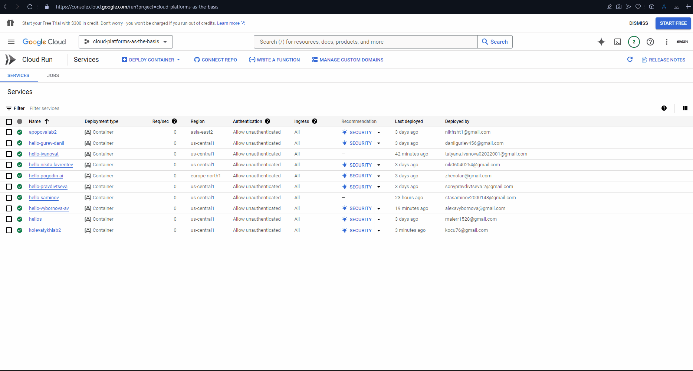
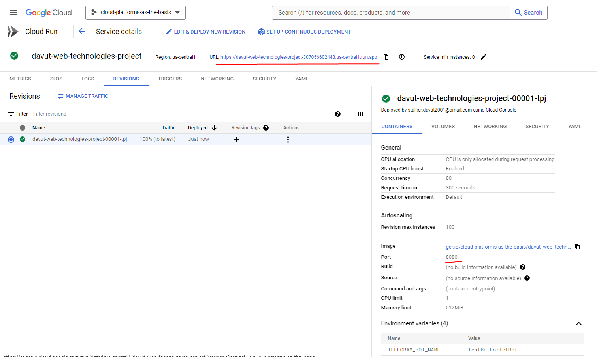
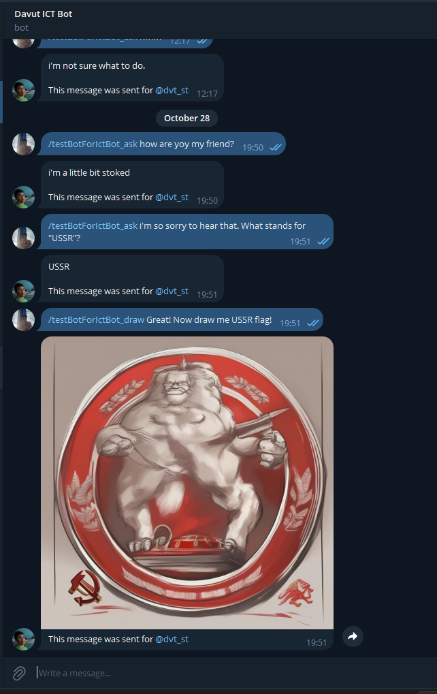
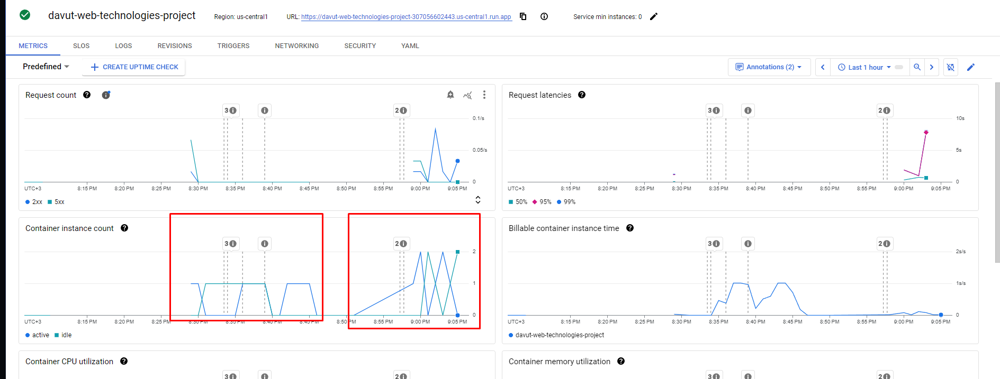

# Lab 2 - Explore Cloud Run

University: [ITMO University](https://itmo.ru)

Faculty: [FTMI](https://ftmi.itmo.ru)

Course: Cloud platforms as the basis of technology entrepreneurship

Year: 2024-2025

Group: U4225

Author: Sukhankulyev Davut Tumenovich

Lab: Lab2

Date of create: 25.10.2024

Date of finished: 28.10.2024

## Task

### Objective
Learn how Cloud Run works.

### Procedure

1. Create a Cloud Run instance using the provided default Hello service with minimal resources. 

    > Important: If you have your own service, use it, as it will be more useful and interesting.

2. Follow the link provided by Cloud Run and test the service.

3. Go to the "Logs" and "Metrics" sections and analyze them.

4. Change your Cloud Run by switching the port to 8090 and see what happens. Try switching traffic between versions and compare the results.

5. Delete all created services and write a report with screenshots.

## Answer

I wanted to expand my knowledge and decided to try deploying a Docker container in Google Cloud Run, especially since I already had a service that I wanted to deploy.

0. Preparing a Docker image of my Web Service:

    1. I created a docker file named `Dockerfile` in root folder of [my project](https://github.com/DavutSukhankuliev/web_technologies_itmo_2024/tree/test/cloud-run-docker-feature) without any extensions and `.dockerignore` for less image size:

        ```dockerfile
        FROM mcr.microsoft.com/dotnet/aspnet:8.0 AS base
        USER $APP_UID
        WORKDIR /app
        EXPOSE 8080
        EXPOSE 8081

        FROM mcr.microsoft.com/dotnet/sdk:8.0 AS build
        ARG BUILD_CONFIGURATION=Release
        WORKDIR /src
        COPY ["web_technologies_itmo_2024/web_technologies_itmo_2024.csproj", "web_technologies_itmo_2024/"]
        RUN dotnet restore "web_technologies_itmo_2024/web_technologies_itmo_2024.csproj"
        COPY . .
        WORKDIR "/src/web_technologies_itmo_2024"
        RUN dotnet build "web_technologies_itmo_2024.csproj" -c $BUILD_CONFIGURATION -o /app/build

        FROM build AS publish
        ARG BUILD_CONFIGURATION=Release
        RUN dotnet publish "web_technologies_itmo_2024.csproj" -c $BUILD_CONFIGURATION -o /app/publish /p:UseAppHost=false

        FROM base AS final
        WORKDIR /app
        COPY --from=publish /app/publish .
        ENTRYPOINT ["dotnet", "web_technologies_itmo_2024.dll"]
        ```

    2. Then I ran the command `docker build -t davut_web_technologies_project .` to build an image

    3. In order to push the docker image into google cloud storage, I had to check the destination so called "Artifact Registry". I found there that I need to push my image into `gcr.io` repo in the `cloud-platforms-as-the-basis` project.
    

    4. Then I used next command to rename my image `docker tag davut_web_technologies_project:latest us-docker.pkg.dev/cloud-platforms-as-the-basis/gcr.io/davut_web_technologies_project:latest`

    5. To ensure that I named it correctly, I entered: `docker images`
    

    6. Then in order to push the image on our Google Cloud registry we need to authorize to our Google Cloud Registry. 

        1. I entered the command:
            ```bash
            gcloud auth configure-docker \
                us-docker.pkg.dev
            ```
            

        2. So I could push the image into our Google Cloud Repo: `docker push us-docker.pkg.dev/cloud-platforms-as-the-basis/gcr.io/davut_web_technologies_project:latest `

        3. Soon the iamge has been pushed in our Google Cloud:
             

1. Then I could Deploy my service as a Docker Image via Cloud Run:


2. After that I could see that my server runs at `https://davut-web-technologies-project-307056602443.us-central1.run.app` URL

    
    Example work:
        

3. I looked through metrics and logs and noticed that Exceptions are logged in metrics. You also can see Service status in "Metrics" tab. How the VM is working. Logs from the project are shown in "Logs" tab. This was very useful.


4. Then I created second revision of the same image file with 8090 port and managed traffic with ratio 50:50 between 2 revisions of the service. The main point I noticed is that we can see that 2 Containers can run at the same time, and i gues the workload is separated in this case.


5. Then I deleted all created cloud run instances and removed docker image :)

## Conclusion
In this lab, I learned the basics of Google Cloud Run by deploying my own Docker-based service.
- I built and pushed a Docker image to Google Cloud’s Artifact Registry and successfully deployed it in Cloud Run, where I tested its functionality.
- I explored the "Logs" and "Metrics" sections to see how Cloud Run monitors service performance and errors.
- Finally, I created a second version of the service with a different port, allowing me to test traffic splitting between versions.
- This lab provided a good overview of deploying and managing containerized applications with Cloud Run.