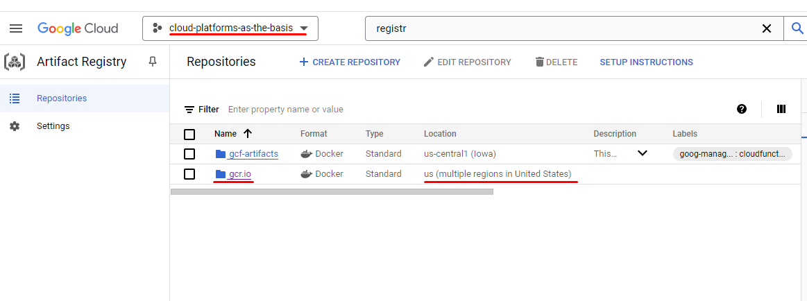
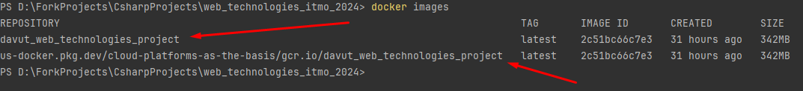
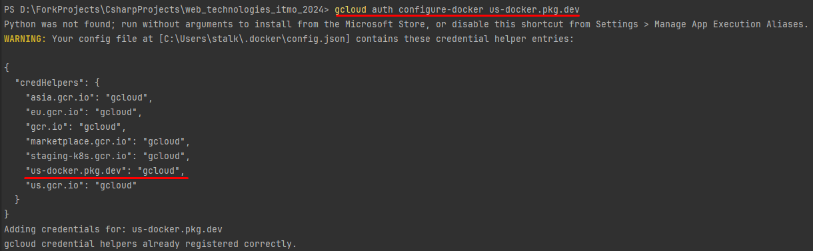
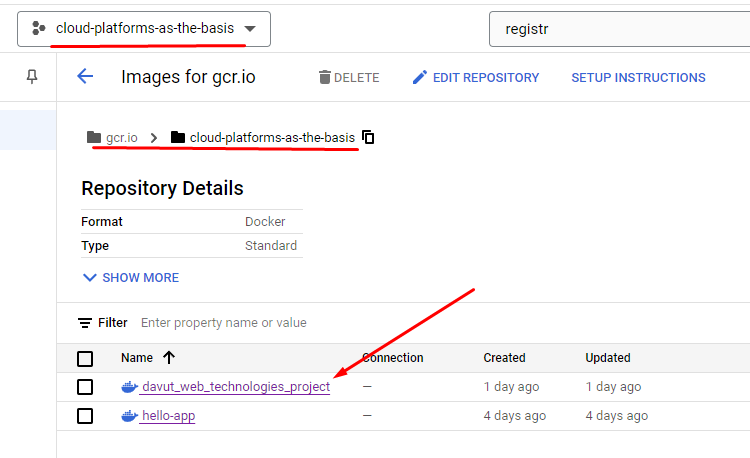

# Lab 2 - Explore Cloud Run
## Task

### Objective
Learn how Cloud Run works.

### Procedure

1. Create a Cloud Run instance using the provided default Hello service with minimal resources. 

    > Important: If you have your own service, use it, as it will be more useful and interesting.

2. Follow the link provided by Cloud Run and test the service.

3. Go to the "Logs" and "Metrics" sections and analyze them.

4. Change your Cloud Run by switching the port to 8090 and see what happens. Try switching traffic between versions and compare the results.

5. Delete all created services and write a report with screenshots.

## Answer

I wanted to expand my knowledge and decided to try deploying a Docker container in Google Cloud Run, especially since I already had a service that I wanted to deploy.

0. Preparing a Docker image of my Web Service:

    1. I created a docker file named `Dockerfile` in root folder of [my project](https://github.com/DavutSukhankuliev/web_technologies_itmo_2024/tree/test/cloud-run-docker-feature) without any extensions and `.dockerignore` for less image size:

        ```dockerfile
        FROM mcr.microsoft.com/dotnet/aspnet:8.0 AS base
        USER $APP_UID
        WORKDIR /app
        EXPOSE 8080
        EXPOSE 8081

        FROM mcr.microsoft.com/dotnet/sdk:8.0 AS build
        ARG BUILD_CONFIGURATION=Release
        WORKDIR /src
        COPY ["web_technologies_itmo_2024/web_technologies_itmo_2024.csproj", "web_technologies_itmo_2024/"]
        RUN dotnet restore "web_technologies_itmo_2024/web_technologies_itmo_2024.csproj"
        COPY . .
        WORKDIR "/src/web_technologies_itmo_2024"
        RUN dotnet build "web_technologies_itmo_2024.csproj" -c $BUILD_CONFIGURATION -o /app/build

        FROM build AS publish
        ARG BUILD_CONFIGURATION=Release
        RUN dotnet publish "web_technologies_itmo_2024.csproj" -c $BUILD_CONFIGURATION -o /app/publish /p:UseAppHost=false

        FROM base AS final
        WORKDIR /app
        COPY --from=publish /app/publish .
        ENTRYPOINT ["dotnet", "web_technologies_itmo_2024.dll"]
        ```

    2. Then I ran the command `docker build -t davut_web_technologies_project .` to build an image

    3. In order to push the docker image into google cloud storage, I had to check the destination so called "Artifact Registry". I found there that I need to push my image into `gcr.io` repo in the `cloud-platforms-as-the-basis` project.
    

    4. Then I used next command to rename my image `docker tag davut_web_technologies_project:latest us-docker.pkg.dev/cloud-platforms-as-the-basis/gcr.io/davut_web_technologies_project:latest`

    5. To ensure that I named it correctly, I entered: `docker images`
    

    6. Then in order to push the image on our Google Cloud registry we need to authorize to our Google Cloud Registry. 

        1. I entered the command:
            ```bash
            gcloud auth configure-docker \
                us-docker.pkg.dev
            ```
            

        2. So I could push the image into our Google Cloud Repo: `docker push us-docker.pkg.dev/cloud-platforms-as-the-basis/gcr.io/davut_web_technologies_project:latest `

        3. Soon the iamge has been pushed in our Google Cloud:
             

1.  