# Lab 3 - Explore Google Cloud Storage | Buckets

University: [ITMO University](https://itmo.ru)

Faculty: [FTMI](https://ftmi.itmo.ru)

Course: Cloud platforms as the basis of technology entrepreneurship

Year: 2024-2025

Group: U4225

Author: Sukhankulyev Davut Tumenovich

Lab: Lab3

Date of create: 28.10.2024

Date of finished: 29.10.2024

## Task

### Objective
Become familiar with the basic concepts and principles of cloud storage, explore various data storage models (block, file, object storage), and get to know the main services and functionalities provided by cloud storage solutions.

### Procedure

1. Select an existing project where you have the appropriate permissions.

2. Create a Cloud Storage bucket.

3. Upload 3-4 images to the Cloud Storage bucket.

4. Create a folder with any name and move the files into it within the bucket.

5. Set up public access for your files in the privacy settings.

6. Generate a link for your files through the file's context menu.

7. Delete all created services after use and write a report using screenshots.

## Answer

1. I entered our course project on Google Cloud Console named `cloud-platforms-as-the-basis`
links

2. Then I created Cloud Storage bucket:
    1. First set the name
    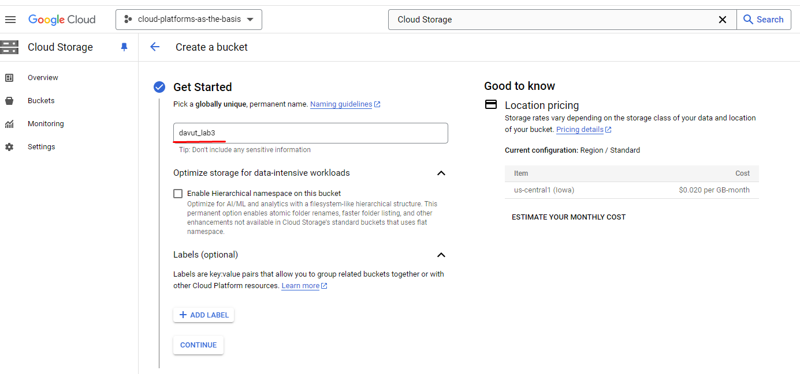

    2. Then set the region
    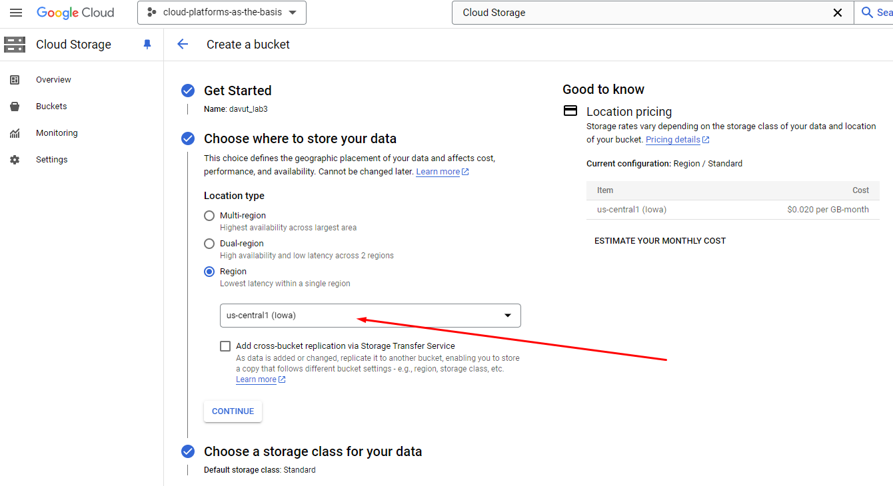

    3. Create the bucket
    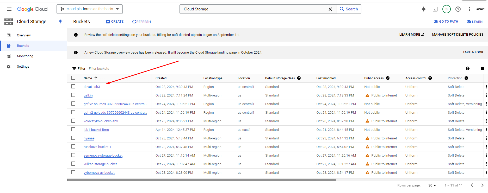

    4. Also set permissions for the account
    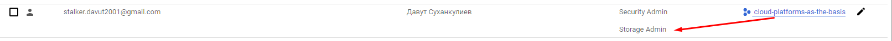

3. Then I uploaded 4 images into my bucket
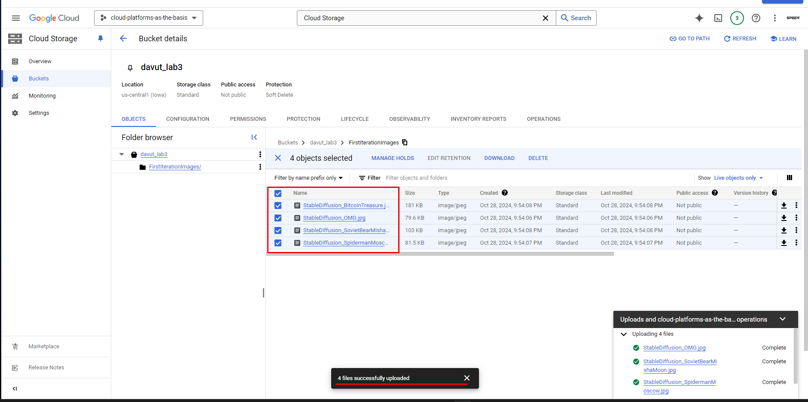

4. After that I created folder in the same bucket and moved my images there. I used Transfer Files Job:
    1. Create a transfer job:
    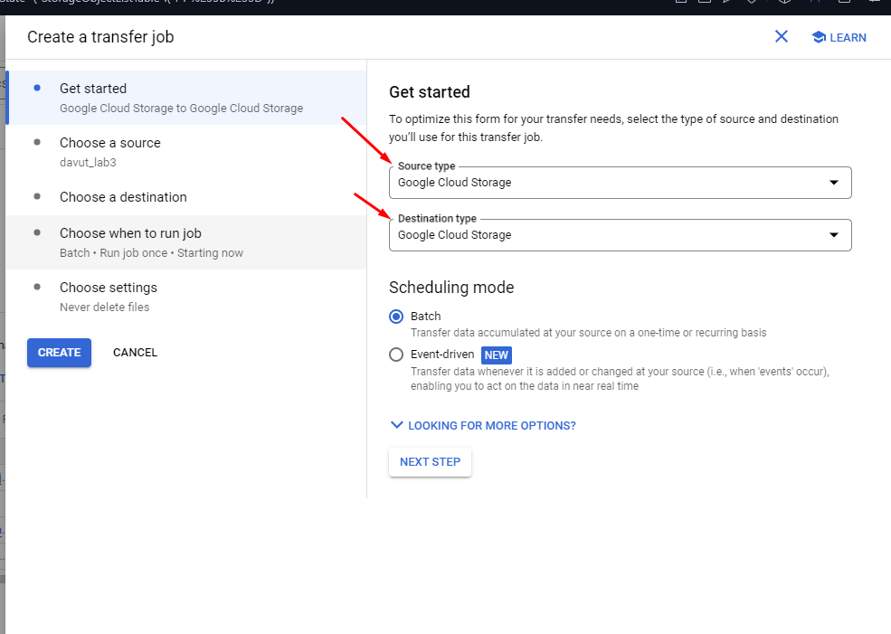 
    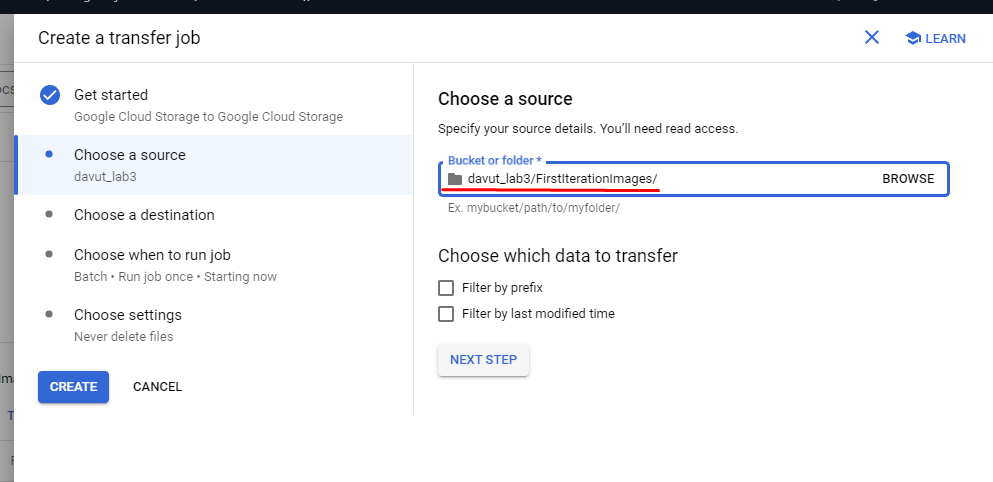 
    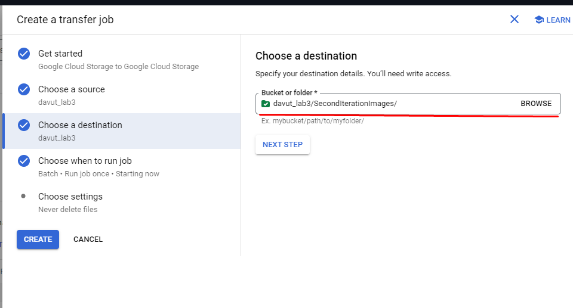 
    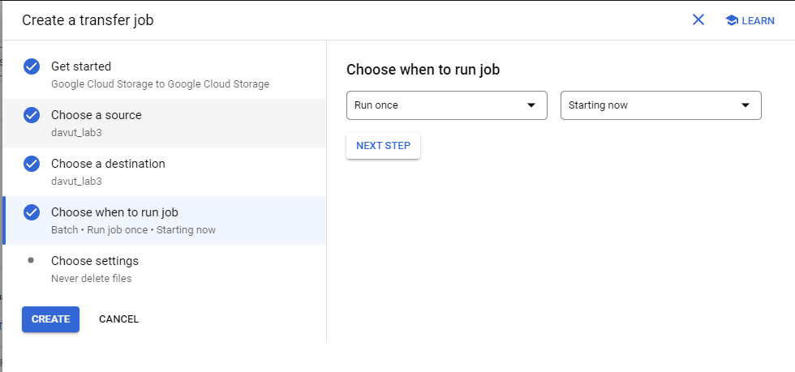 
    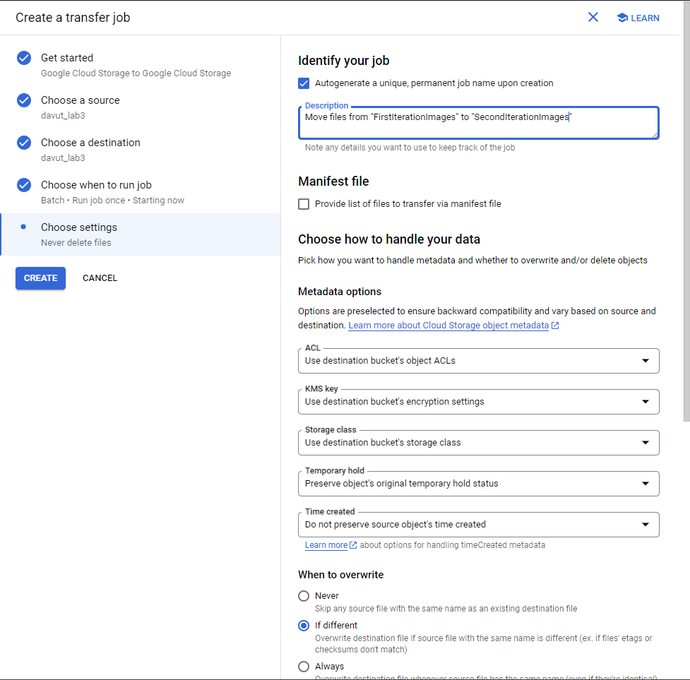 
    2. Then I ensured that my job was running at that time:
    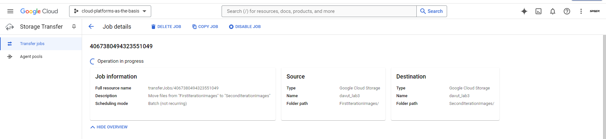 
    3. At last my job finished. Also I could assert that my files were copied but not moved:
    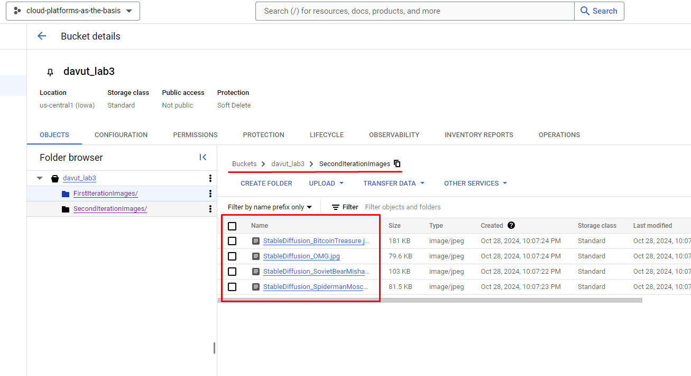 
    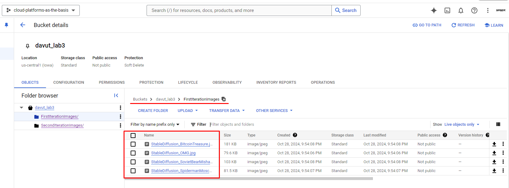

5. Then I granted to `allUsers` permission to view files. I set them the role `Storage viewer` on my folder:
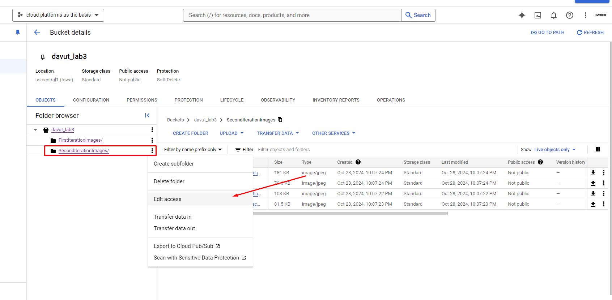 
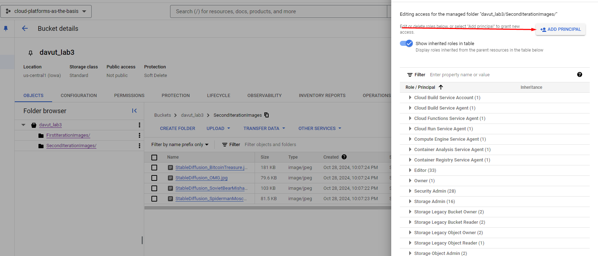 
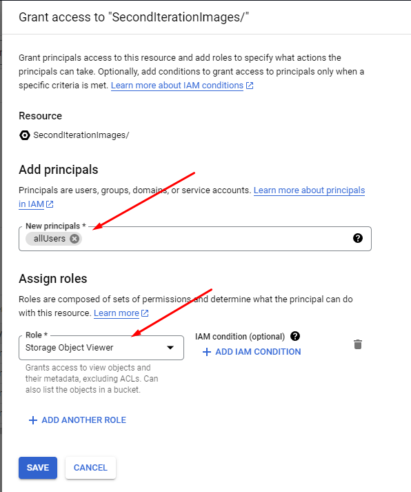

6. Generated links for my files:
    - [SpidermanInMoscow.jpg](https://storage.googleapis.com/davut_lab3/SecondIterationImages/StableDiffusion_SpidermanMoscow.jpg)
    - [SovietBearOnMoon.jpg](https://storage.googleapis.com/davut_lab3/SecondIterationImages/StableDiffusion_SovietBearMishaMoon.jpg)
    - [OMG.jpg](https://storage.googleapis.com/davut_lab3/SecondIterationImages/StableDiffusion_OMG.jpg)
    - [BitcoinTreasure.jpg](https://storage.googleapis.com/davut_lab3/SecondIterationImages/StableDiffusion_BitcoinTreasure.jpg)
    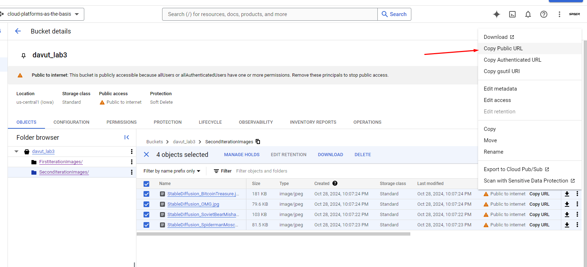

7. Removed my own bucket from the Console

## Conclusion
In this lab, I learned the basics of Google Cloud Storage by by creatin my own bucket. I learned to:
- Create and configure storage buckets; 
- Manage file uploads;
- Organize files within folders. 
I also practiced:
- Setting up public access to files and generating public URLs;
- Making the files accessible to all users.

This exercise improved my understanding of cloud storage permissions and file accessibility. Finally, I cleaned up by deleting all resources, reinforcing the importance of managing cloud resources responsibly.