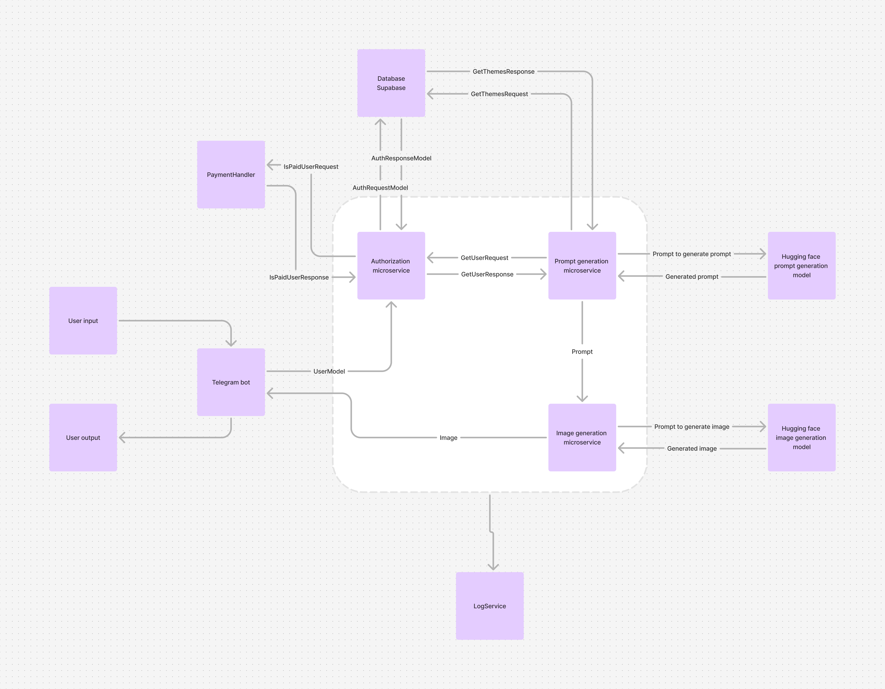

# Lab 4 - Explore Infrastructure

University: [ITMO University](https://itmo.ru)

Faculty: [FTMI](https://ftmi.itmo.ru)

Course: Cloud platforms as the basis of technology entrepreneurship

Year: 2024-2025

Group: U4225

Author: Sukhankulyev Davut Tumenovich

Lab: Lab4

Date of create: 01.11.2024

Date of finished: 11.11.2024

## Task

### Objective
Create AI web app infrastructure scheme and calculate economics

## Scheme

### Economics

#### 1. Google Cloud Run for Microservices
There are four microservices in the architecture:
   - **Authorization Microservice**
   - **Prompt Generation Microservice**
   - **Image Generation Microservice**
   - **LogService**

Assumptions:
- Each microservice will run with **1 instance**.
- Minimum monthly usage, so we'll assume 1 vCPU and 256 MB of memory per instance.
- Estimated active usage per instance is **continuously for the whole month**.

##### Cloud Run Pricing (for 1 vCPU and 256 MB per instance):
- **vCPU**: $0.000024 per second
- **Memory**: $0.0000025 per second
- **Free tier**: 180,000 vCPU-seconds, 360,000 GB-seconds per month.

##### Cost per microservice instance for a whole month (assuming 24/7 operation):

1. **vCPU cost per instance**:  
   

   vCPU Cost = 24 (hours/day) &times; 3600 (seconds/hour) &times; 30 (days) &times; 0.000024 (USD/second) = 62.21 USD
   

2. **Memory cost per instance**:  
   

   Memory Cost = 24 (hours/day) &times; 3600 (seconds/hour) &times; 30 (days) &times; 0.0000025 (USD/second) = 6.48 USD
   

3. **Total cost per instance**:  
   

   Total Cost per Instance = 62.21 + 6.48 = 68.69 USD
   

Since there are 4 microservices, the total cost for Cloud Run instances is:

4 &times; 68.69 = 274.76 USD

#### 2. Supabase Database for User Authentication and Data Storage
Assuming the **Pro** plan from Supabase as a minimal paid plan for production use:
- **Pro Plan**: $25 per month, includes dedicated resources, automated backups, and 8 GB database storage.

Total cost for Supabase:

25 USD per month

#### 3. Hugging Face Models: LLaMA and Stable Diffusion 3.5
Using Hugging Face's paid tiers to host and run LLaMA for text generation and Stable Diffusion 3.5 for image generation may involve:
- **Text generation (LLaMA)**: Estimated based on the Hugging Face API usage costs for large language models, typically in the range of $0.01–$0.05 per request.
- **Image generation (Stable Diffusion 3.5)**: Estimated at around $0.02–$0.10 per request, depending on model complexity and resources.

Assumptions for monthly usage:
- **Text generation requests**: 10,000 calls per month
  - Estimated cost = 10,000 &times; $0.03 = **$300**
- **Image generation requests**: 5,000 calls per month
  - Estimated cost = 5,000 &times; $0.05 = **$250**

Total Hugging Face Model Cost = 300 + 250 = 550 USD

### Total Monthly Cost Estimate
Adding up the costs calculated:
- **Google Cloud Run**: 274.76 USD
- **Supabase Database**: 25 USD
- **Hugging Face Models** (LLaMA and Stable Diffusion 3.5): 550 USD

Total estimated minimum cost:

274.76 + 25 + 550 = 849.76 USD per month

This estimate covers Google Cloud, Supabase, and Hugging Face API costs based on expected usage.

## Conclusion
In this lab we learnt how to architect infrastructures and plan finances for the Web App Deployment in Google Cloud Services.